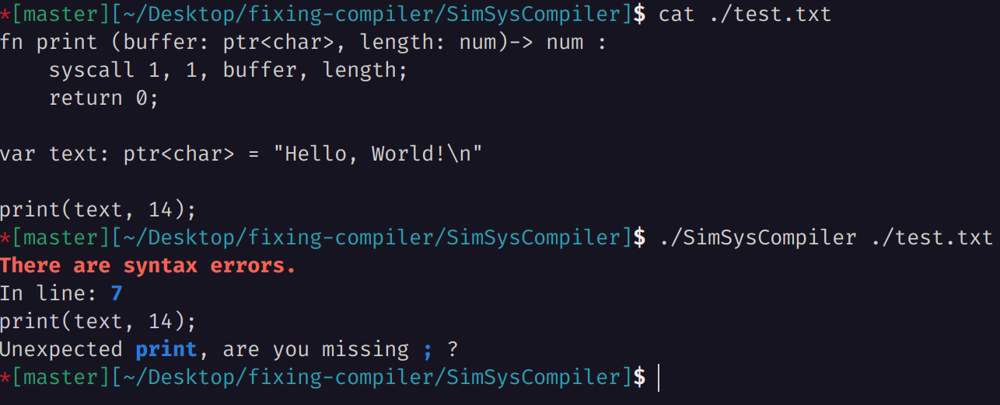
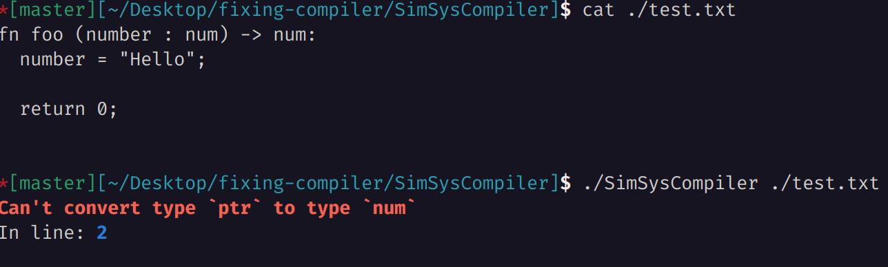
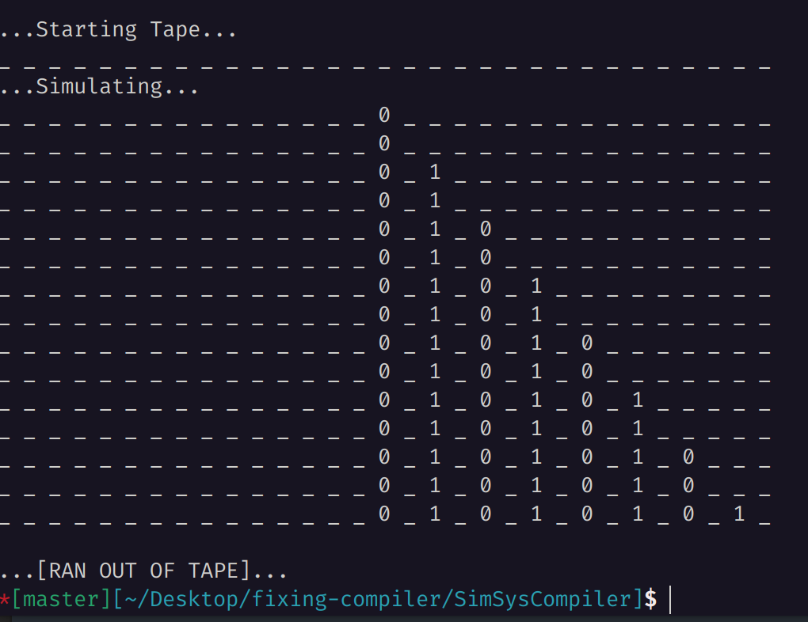

# Simple System Compiler
A small compiler project that emits x86 64bit assembly for a basic language defined below. The project has only been tested under Linux. 
(Last significant changes in 2019)

## Dependencies
* C++17 Standard Library
* `nasm` and `ld` executables

This project depends only on the C++17 Standard Library to emit a .asm file (x86 64bit assembly as plain text); it then automatically calls `nasm` to assemble the generated .asm file into machine code, and the calls `ld` to link the machine code and emit a Linux executable.

## Language Features
The language supports the basic control structures one would expect, including (white spaces matter like in python):

*Statically Typed Variables*
```
var i : num = 0;
var text: ptr<char> = "Hello, World!\n";
```

*Functions*
```
fn print (buffer: ptr<char>, length: num) -> num:
  syscall 1, 1, buffer, length;
  return 0;

print("Hello, World!\n", 14)
```

*Loops*
```
var i : num = 0;
for i -> max:
  *(buffer + i) = 0;

var j : num = 0;
while j < count:
  ....
  j = j + 2;
```

*If Logic*
```
if value == 0:
  ...
```

## Compiler Features
The compiler will spot syntax errors and attempts to report a fix:

Including type errors:


## Example
The repository comes with the `turing.acc` programme, which is a programmable turing machine written using this compiler. The usage of `turing.acc` is as follows:
When running the program, you are first asked to programme the turing machine by specifying the rules of how to transform the tape. The beginning state of the machine is denoted `b`, and the accepting state is denoted `A`. A simple rule that changes the first 0 on the tape to a 1 and then stops looks like this:
```
<m-config> <tape symbol> <print op> <tape op> <final m-config>
b 0 1 r A
```
* m-config is what state the machine needs to be in for the rule to apply.
* tape symbol is the symbol on the tape (0, 1 or \_) the rule applies to
* print op is what symbol to place on the tape (0, 1 or \_)
* tape op is if the head should be moved right or left (r or l)
* final m-config is what state the machine enters after executing the rule

After this (continue by entering an empty line), the programme asks for the initial tape configuration, which is a sequence of 1s and 0s with all other entries being blank (_). It then simulates the Turing machine.

A simple example is the following machine.
```
Usage (Be precise):
<m-config> <tape symbol> <print op> <tape op> <final m-config>

b _ 0 r c
c _ _ r e
e _ 1 r f
f _ _ r b
```
It will simply fill up the tape to the right with the sequence 0 \<blank\> 1 until it runs out of tape. The output of `turing.acc` then looks like


## Installing and Usage
To build the project, you will need CMake and a C++ Compiler.
* Clone this repository
* Then run `cmake .` and then `cmake --build .`

To use the compiler, simply run
`./SimSysCompiler <input file>`

You can use the `-l` flag to write the log to the console (also generated as `log.html`) that is: `./SimSysCompiler <input file> -l`

With the `-o` flag you can specify the output file, that is `./SimSysCompiler <input file> -l -o <output file>`.
